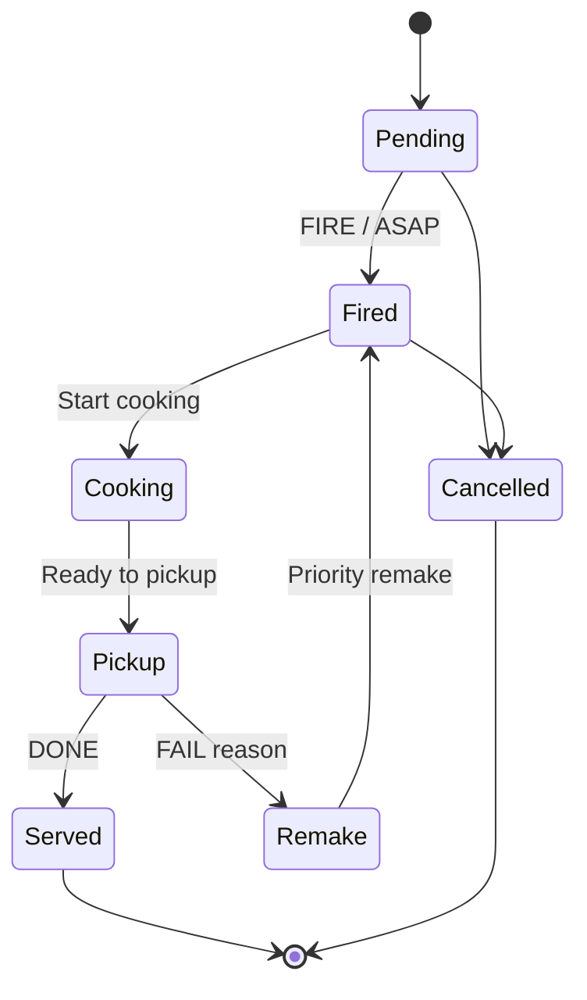

<div align="center">

# Maison Lucas Kitchen & Expeditor

**A timing-focused kitchen display for coordinated preparation, pickup and service.**


</div>

---

## Overview

This repository contains the kitchen display system used by station staff and the expeditor. The interface prioritises readable timers, explicit status colour, large controls and stable ticket positions over decorative UI.

## Operational lifecycle



## Workspaces

### Expeditor

- Groups all items by table bill
- Displays guests, nationality, last order source, allergies and special requests
- Supports multi-select state actions and safe state-dependent disabling
- Filters new, cooking, overtime, pickup and remake work
- Preserves completed bills in same-day history
- Provides searchable lifecycle logs for operational traceability

### Station

- Joins a dedicated hot kitchen, cold kitchen, pizza, pastry or bar station
- Shows only items routed to that preparation area
- Keeps list headers visible while items scroll
- Starts countdown timing only when cooking begins
- Uses full-card progress colour and clear overtime escalation

## Local setup

```bash
cp .env.example .env.local
npm install
npm run dev -- -p 3010
```

Open `http://localhost:3010`. A valid staff account and the corresponding kitchen permissions are required for live operations.

## Commands

| Command | Purpose |
|---|---|
| `npm run dev -- -p 3010` | Start development without conflicting with customer web |
| `npm run lint` | Check TypeScript and React source |
| `npm run build` | Validate and create the production build |
| `npm start -- -p 3010` | Serve the production build |

## Source layout

```text
app/
├── page.tsx           Expeditor, station, history and logs
├── globals.css        High-density kitchen layout
├── theme.css          Semantic status and theme tokens
├── ThemeProvider.tsx  Theme state
└── layout.tsx         Metadata and root document
```

## Related repositories

- [Backend API](https://github.com/BeoGTSDev/restaurant-system-backend)
- [POS Desktop](https://github.com/BeoGTSDev/restaurant-system-fe-pos)
- [Customer Ordering Web](https://github.com/BeoGTSDev/restaurant-system-fe-csweb)

